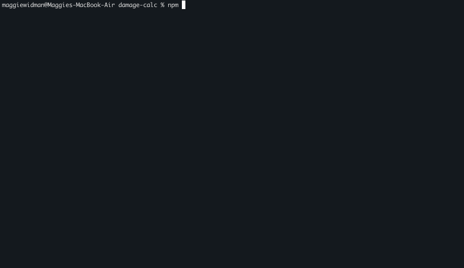

# ⚔️ Dumnorix's D&D Combat Assistant

A comprehensive CLI combat system for D&D 2024, featuring turn management, attack rolls, damage calculation, and detailed combat logging. Built specifically for Dumnorix the Barbarian with full support for Reckless Attack, Brutal Strike, Savage Attacks, and more.

## ⚔️ See It In Action

*Epic combat sequences with animated ASCII art, turn management, and comprehensive logging!*

## ✨ Core Features

### 🎯 **Complete Combat System**
- **Turn Management**: Full turn-based combat with action tracking
- **Attack Rolls**: Normal, Reckless, and Brutal Strike attacks with advantage calculation
- **Damage Calculation**: Automatic critical hit detection and damage rolling
- **Combat History**: Beautiful turn-by-turn combat logs with damage totals
- **Quick Actions**: Standalone attack and damage rolls for testing

### 🎨 **Beautiful Interface**
- **Animated ASCII Art**: Epic character intro with dynamic weapon display
- **Interactive Menus**: Clean navigation between combat actions
- **Color-Coded Output**: Easy-to-read attack results and damage breakdowns
- **Critical Hit Animations**: Random spectacular effects for critical strikes

### 🧠 **Smart D&D 2024 Logic**
- **House Rule Support**: Miss → Reckless Attack reroll option
- **Feature Tracking**: Per-turn ability usage (Brutal Strike, Savage Attacks)
- **Heroic Inspiration**: Auto-prompts on low rolls, session tracking
- **Attack Type Logic**: Brutal Strike and Reckless Attack are mutually exclusive

## 🎮 Usage Modes

### 🌟 **Start Turn** (Recommended)
Complete turn-based combat with action economy: